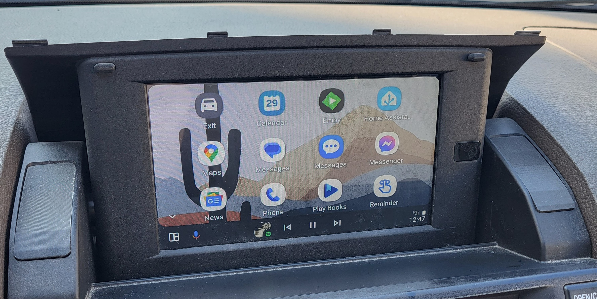
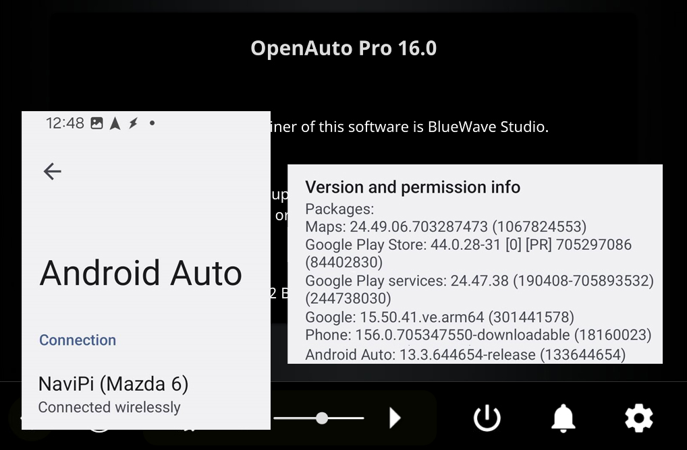
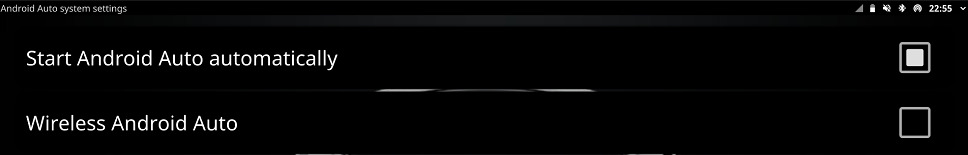
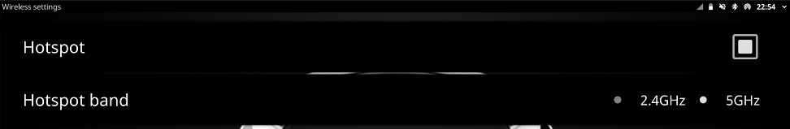

# aa-proxy-oap
An "aa-proxy-rs", (a Rust implementation of AA Wireless Dongle) USB Gadget Integration for OpenAuto Pro.

### **Update your OpenAuto Pro installation with Android Auto Wireless compatible with Android App version > 12.6+ (currently working on 13.3+)!**

---

I managed to find a workaround that implements an emulated usb dongle device inside the same Raspberry Pi that runs OpenAuto-Pro, so the phone is connected wirelessly, but OpenAuto *thinks* it's connected by USB. 

 

 


<a href="https://www.paypal.com/donate/?business=R9V8AAFPNV684&no_recurring=0&currency_code=EUR">

</a>

### **NOTICE: This is a WORK IN PROGRESS.**

This took weeks and needed configurations across the whole Host/Headunit raspbian buster image, so I will try to document everything. I will come back and add/fix things for a while.  


# Installation

**Terms** used:
```
Host/Headunit:              RPI 4B running OpenAuto-Pro
```

## 1. Setup OpenAuto-Pro
* Disable `Wireless Android Auto` under `Settings --> Android Auto --> System`:
 


* Enable `Hotspot` at either `2.4Ghz` or `5Ghz` (it doesn't matter, we set it manually) under `Settings --> Wireless`:
 

**Important**: Don't change these settings again, because they will override our modifications below.

## 2. Easiest method / Prebuilt binaries

The prebuilt kernels are based on `5.10.110` for Raspberry Pi 3 `bcm2709` and Raspberry Pi 4 `bcm2711`, `armhf` 32bit **only**.

#### CAUTION: THIS WILL REPLACE YOUR KERNEL, YOUR BLUETOOTH AND YOUR WI-FI/INTERNET CONFIGURATION. BACKUP YOUR SDCARD. PROCEED AT YOUR OWN RISK.

Download the repository:
```
git clone https://github.com/KreAch3R/aa-proxy-oap
```
And install all necessary files.  

```
cd aa-proxy-oap/aa-proxy-oap
sudo cp -r common/* /
```
For Rapsberry Pi 3 board:
```
sudo cp -r board/bcm2709/* /
```
For Rapsberry Pi 4 board:
```
sudo cp -r board/bcm2711/* /
```


Lastly, enable the services:

```
sudo systemctl enable aa-proxy.service
sudo systemctl enable aa-usbgadget.service
```

After that, **reboot** your **Host**.

## 2. DIY / Build from source

Follow the [docs](docs/README.md).


# Result:

After the first reboot, remove any Bluetooth connections to your phone and reconnect using `Bluetooth Manager`. The default Bluetooth name and the default Wi-Fi SSID is `NaviPi`.

Then do another reboot.

If everything runs correctly, after booting, the **Host** should launch OpenAuto-Pro as usual, then immediately connect to your phone, the phone should connect to the **Host**'s Wi-Fi hotspot, and then launch the AA Wireless sequence.

Log (from `/var/log/aa-proxy-rs.log`):
```
2024-12-28, 00:46:56.616 [INFO] 🛸 aa-proxy-rs is starting, build: 20241228_022643, git: 20241224-38a633c-dirty
2024-12-28, 00:46:56.664 [INFO]  main:  📜 Log file path: /var/log/aa-proxy-rs.log
2024-12-28, 00:46:56.664 [INFO]  main:  ⚙️ Showing transfer statistics: disabled
2024-12-28, 00:46:56.740 [INFO]  proxy:  🛰️ Starting TCP server...
2024-12-28, 00:46:56.741 [INFO]  proxy:  🛰️ TCP server bound to:  0.0.0.0:5288
2024-12-28, 00:46:56.741 [INFO]  proxy:  💤 waiting for bluetooth handshake...
2024-12-28, 00:46:56.781 [INFO]  usb:  Using UDC: "dummy_udc.0"
2024-12-28, 00:46:56.781 [INFO]  usb:  🔌 Initializing USB Manager
2024-12-28, 00:46:56.782 [INFO]  usb:  🔌 USB Manager: Disabled all USB gadgets
2024-12-28, 00:46:56.782 [INFO]  bluetooth:  🥏 Bluetooth alias: NaviPi
2024-12-28, 00:46:57.256 [INFO]  bluetooth:  🥏 Opened bluetooth adapter hci0 with address XX:XX:XX:XX:XX:XX
2024-12-28, 00:46:57.728 [INFO]  bluetooth:  📱 AA Wireless Profile: registered
2024-12-28, 00:46:57.733 [INFO]  bluetooth:  🎧 Headset Profile (HSP): registered
2024-12-28, 00:46:57.734 [INFO]  bluetooth:  ⏳ Waiting for phone to connect via bluetooth...
2024-12-28, 00:47:15.584 [INFO]  bluetooth:  📱 AA Wireless Profile: connect from: 30:74:67:AF:9C:C2
2024-12-28, 00:47:15.584 [INFO]  bluetooth:  📲 Sending parameters via bluetooth to phone...
2024-12-28, 00:47:15.585 [INFO]  bluetooth:  🛜 Sending Host IP Address: 10.0.0.1
2024-12-28, 00:47:15.585 [INFO]  bluetooth:  📨 stage #1 of 5: Sending WifiStartRequest frame to phone...
2024-12-28, 00:47:15.624 [INFO]  bluetooth:  📨 stage #2 of 5: Received WifiInfoRequest frame from phone (⏱️ 39 ms)
2024-12-28, 00:47:15.624 [INFO]  bluetooth:  🛜 Sending Host SSID and Password: NaviPi, AANaviPi
2024-12-28, 00:47:15.624 [INFO]  bluetooth:  📨 stage #3 of 5: Sending WifiInfoResponse frame to phone...
2024-12-28, 00:47:15.628 [INFO]  bluetooth:  📨 stage #4 of 5: Received WifiStartResponse frame from phone (⏱️ 3 ms)
2024-12-28, 00:47:19.764 [INFO]  bluetooth:  📨 stage #5 of 5: Received WifiConnectStatus frame from phone (⏱️ 4134 ms)
2024-12-28, 00:47:19.764 [INFO]  proxy:  🛰️ TCP server: listening for phone connection...
2024-12-28, 00:47:19.764 [INFO]  bluetooth:  🚀 Bluetooth launch sequence completed
2024-12-28, 00:47:19.959 [INFO]  usb:  🔌 USB Manager: Switched to accessory gadget
2024-12-28, 00:47:19.959 [INFO]  bluetooth:  🥷 Unregistering default agent
2024-12-28, 00:47:19.960 [INFO]  bluetooth:  📱 Removing AA profile
2024-12-28, 00:47:21.976 [INFO]  proxy:  📳 TCP server: new client connected: 10.0.0.20:37640
2024-12-28, 00:47:21.977 [INFO]  proxy:  📂 Opening USB accessory device: /dev/usb_accessory
2024-12-28, 00:47:21.977 [INFO]  proxy:  ♾️ Starting to proxy data between TCP and USB...
2024-12-28, 00:47:22.461 [WARN]  bluetooth:  🎧 Error waiting for HSP profile task: deadline has elapsed
2024-12-28, 00:47:22.461 [INFO]  bluetooth:  💤 Bluetooth adapter stays on
```

# Troubleshooting

If something doesn't work, then you really should read the [docs](docs/README.md) to understand what's happening under the hood, and start working on your issue.