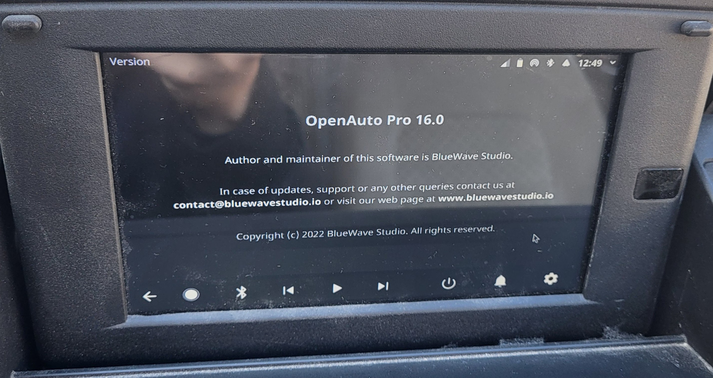
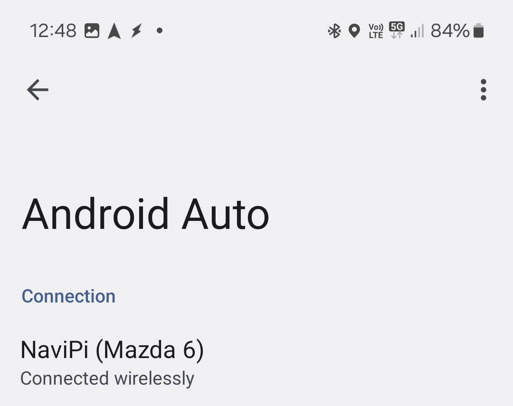
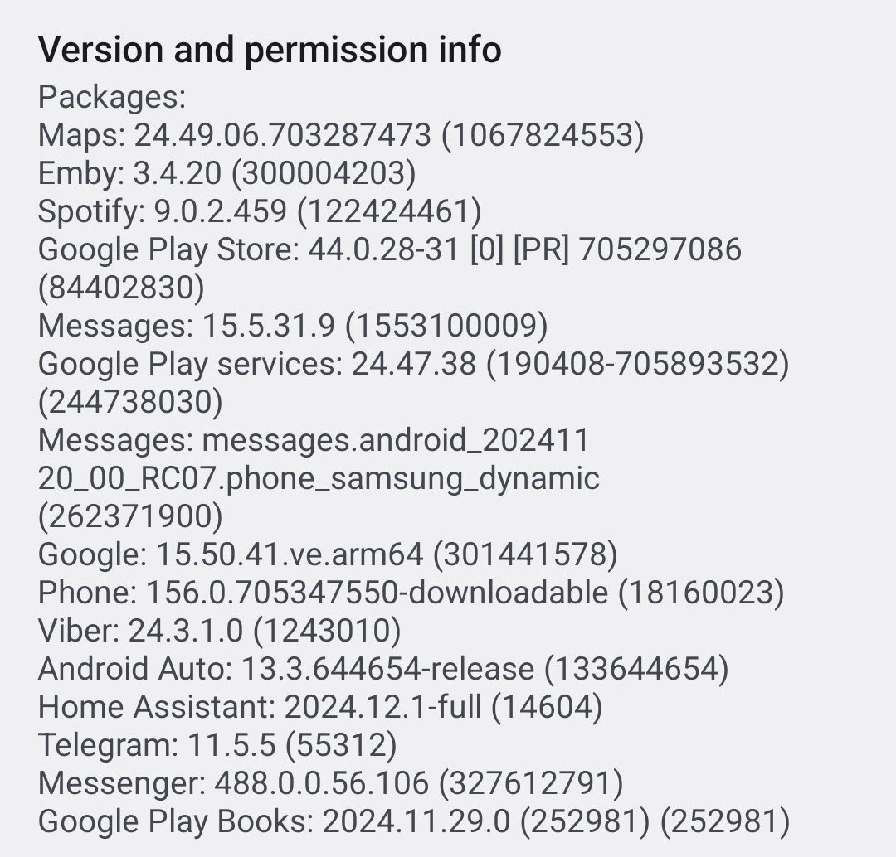

# aa-proxy-oap
An "aa-proxy-rs", (a Rust implementation of AA Wireless Dongle) USB Gadget Integration for OpenAuto Pro.

**This is a WORK IN PROGRESS.**

This took weeks and needed configurations across the whole Host/Headunit raspbian buster image, so I will try to document everything. I will come back and add/fix things for a while. 

Some **Terms** used:
```
Host/Headunit:              RPI 4B running OpenAuto-Pro
Device/USB Gadget:          RPI 4B running an emulated OTG/USB Gadget device and using dummy_hcd to become a device to itself
aawg/aa-proxy-rs:           The program providing the wired to wireless AA proxy
```

# 1. High level explanation

### History

Starting on September 2023, with Android Auto update 12.7+, wireless AA stopped working on OpenAuto-Pro, and produced a black screen. At the same time, the same bug presented on Crankshaft, the original opensource  project that OpenAuto-Pro was based upon, but which never had working wireless AA.

OpenAuto-Pro went out of business, while OpenAuto-Pro and Crankshaft users started debugging the problem. Many found out that by using aftermarket AA wireless dongles, everything worked correctly.

That sent me into a research about opensource AA wireless dongles, and I found the awesome project of [nisargjhaveri/WirelessAndroidAutoDongle](https://github.com/nisargjhaveri/WirelessAndroidAutoDongle). After I tested it successfully using a RPI-zero2w, I wanted to bypass the step of using two separate PIs and started looking for ways of emulating the second pi.

### Feasibility

I came around the awesome blog of Andrzej Pietrasiewicz:
https://www.collabora.com/news-and-blog/blog/2019/06/24/using-dummy-hcd/

There, he explains that using a kernel module named `dummy_hcd` we can emulate a USB UDC controller, so we can create a controller that *accepts connections from itself as if a USB-GADGET DEVICE is connected to it*.

The next step was incorporating the configurations of the `WirelessAndroidAutoDongle` image inside our own Raspbian Buster 32bit version of our RPI 4B pi, which proved to be a big task on its own.

That was because, the OpenAuto-Pro raspbian buster image is based on the 5.10.y rpi kernel (specifically, 5.10.103), while the `AAWirelessDongle` images are built using `buildroot` and are based on far newer kernels. 

That means that the `aawg` binary wasn't able to be installed as-is, because it required far newer *"runtime libraries"* like `libc`. As far as I searched, I couldn't find any way to build `aawg` statically.

Then, another awesome project based on `WirelessAndroidAutoDongle` came to the rescue, [manio/aa-proxy-rs](https://github.com/manio/aa-proxy-rs). This one can be built completely statically!

### Proof of concept

So, to sum up, we need to:

1. Re-build the kernel for our OpenAuto-Pro image, include all the necessary modifications for `usb-gadget` and `dummy_hcd` to work, and install it. 
2. Build `aa-proxy-rs` statically or use the pre-built binary of this repo.
3. Install the `Bluetooth`, `hostapd`, `dnsmasq` and all the other changes to our **Host** system.


# 2. Low level How-To

### A. Build and install the kernel

Instructions: [kernel/README.md](https://github.com/KreAch3R/aa-proxy-oap/blob/main/kernel/README.md).

### B. Build and install `dummy_hcd`

Instructions: [kernel/modules/raw-gadget/dummy_hcd/README.md](https://github.com/KreAch3R/aa-proxy-oap/blob/main/kernel/modules/raw-gadget/dummy_hcd/README.md).

### C. Modify `/etc/modules`

* Add the necessary modules to start at boot.  
* Equivalent to `sudo modprobe MODULE` after boot.  
* This correlates with the running kernel configs. Configs marked as `=m` **NEED** to be included here. 

### D. Build and install `uMTP-Responder`

* This is needed for the `usb-gadget` service to work.  
* Instructions: [uMTP-Responder/README.md](https://github.com/KreAch3R/aa-proxy-oap/blob/main/uMTP-Responder/README.md).

### E. Install all files inside `aa-proxy-oap`

* The file structure of the `aa-proxy-oap` subfolder is following the structure of another project of mine, [navipi-usb-update](https://github.com/KreAch3R/navipi-usb-update).  
Basically, it's a copy-paste mechanism so the folders correspond to the **Host** system root folders and subfolders. It's not necessary to use this mechanism to install the files. 

#### a. Bluetooth

* `aa-proxy-rs` is handling the Bluetooth connection. 
* The `main.conf` file is needed.
* You can edit the BLE device name [here](https://github.com/KreAch3R/aa-proxy-oap/blob/6bf6b8f2b33cf9f97e480fea18d424b288a35f68/aa-proxy-oap/usr/local/bin/aa-proxy/aa-proxy-rs.sh#L11).

#### b. Wi-Fi Hotspot / hostapd / dhcpcd / dnsmasq

* AA wireless requires a working Wi-Fi Hotspot setup by the **Host** system, and then `aa-proxy-rs` conveys the `ssid` and `password` to the phone through the established Bluetooth connection. 
* `hostapd` and `dhcpcd` modifications are required for this. In constract to `WirelessAndroidAutoDongle` modifications, we need to use `dhcpcd`. 
* Important: `OpenAuto-Pro` provides a `hotspot` toggle that modifies the same files. Make sure to enable it first, then edit the files. That makes sure that there aren't any conficts. 
* You can edit the `ssid` and `password` of the hotspot [here](https://github.com/KreAch3R/aa-proxy-oap/blob/6bf6b8f2b33cf9f97e480fea18d424b288a35f68/aa-proxy-oap/etc/hostapd/hostapd.conf#L16), while the IP address [here](https://github.com/KreAch3R/aa-proxy-oap/blob/6bf6b8f2b33cf9f97e480fea18d424b288a35f68/aa-proxy-oap/etc/dhcpcd.conf#L62) and range [here](https://github.com/KreAch3R/aa-proxy-oap/blob/6bf6b8f2b33cf9f97e480fea18d424b288a35f68/aa-proxy-oap/etc/dnsmasq.conf#L2).

#### c. Systemd

* In constract to `WirelessAndroidAutoDongle` modifications, we can't use `/etc/init.d`. At least, I didn't find out how. 
* I translated the necessary startup scripts to `systemd` services, so that the `usb-gadget` can be setup after boot and `aa-proxy-rs` can be run.

#### d. Install `aa-proxy-rs` folder inside `/usr/local/bin`

* It contains the script used by `systemd` as well as a statically built `aa-proxy-rs` working binary. 
* If you want to build it on your own, check [here](https://github.com/KreAch3R/aa-proxy-rs?tab=readme-ov-file#dependencies).

# 3. Result:

If everything runs correctly, after booting, the **Host** should launch OpenAuto-Pro as usual, then immediately connect to your phone, the phone should connect to the **Host**'s Wi-Fi hotspot, and then launch the AA Wireless sequence. 

Log (from `/var/log/aa-proxy-rs.log`):
```
2024-12-28, 00:46:56.616 [INFO] 🛸 aa-proxy-rs is starting, build: 20241228_022643, git: 20241224-38a633c-dirty
2024-12-28, 00:46:56.664 [INFO]  main:  📜 Log file path: /var/log/aa-proxy-rs.log
2024-12-28, 00:46:56.664 [INFO]  main:  ⚙️ Showing transfer statistics: disabled
2024-12-28, 00:46:56.740 [INFO]  proxy:  🛰️ Starting TCP server...
2024-12-28, 00:46:56.741 [INFO]  proxy:  🛰️ TCP server bound to:  0.0.0.0:5288
2024-12-28, 00:46:56.741 [INFO]  proxy:  💤 waiting for bluetooth handshake...
2024-12-28, 00:46:56.781 [INFO]  usb:  Using UDC: "dummy_udc.0"
2024-12-28, 00:46:56.781 [INFO]  usb:  🔌 Initializing USB Manager
2024-12-28, 00:46:56.782 [INFO]  usb:  🔌 USB Manager: Disabled all USB gadgets
2024-12-28, 00:46:56.782 [INFO]  bluetooth:  🥏 Bluetooth alias: NaviPi
2024-12-28, 00:46:57.256 [INFO]  bluetooth:  🥏 Opened bluetooth adapter hci0 with address XX:XX:XX:XX:XX:XX
2024-12-28, 00:46:57.728 [INFO]  bluetooth:  📱 AA Wireless Profile: registered
2024-12-28, 00:46:57.733 [INFO]  bluetooth:  🎧 Headset Profile (HSP): registered
2024-12-28, 00:46:57.734 [INFO]  bluetooth:  ⏳ Waiting for phone to connect via bluetooth...
2024-12-28, 00:47:15.584 [INFO]  bluetooth:  📱 AA Wireless Profile: connect from: 30:74:67:AF:9C:C2
2024-12-28, 00:47:15.584 [INFO]  bluetooth:  📲 Sending parameters via bluetooth to phone...
2024-12-28, 00:47:15.585 [INFO]  bluetooth:  🛜 Sending Host IP Address: 10.0.0.1
2024-12-28, 00:47:15.585 [INFO]  bluetooth:  📨 stage #1 of 5: Sending WifiStartRequest frame to phone...
2024-12-28, 00:47:15.624 [INFO]  bluetooth:  📨 stage #2 of 5: Received WifiInfoRequest frame from phone (⏱️ 39 ms)
2024-12-28, 00:47:15.624 [INFO]  bluetooth:  🛜 Sending Host SSID and Password: NaviPi, AANaviPi
2024-12-28, 00:47:15.624 [INFO]  bluetooth:  📨 stage #3 of 5: Sending WifiInfoResponse frame to phone...
2024-12-28, 00:47:15.628 [INFO]  bluetooth:  📨 stage #4 of 5: Received WifiStartResponse frame from phone (⏱️ 3 ms)
2024-12-28, 00:47:19.764 [INFO]  bluetooth:  📨 stage #5 of 5: Received WifiConnectStatus frame from phone (⏱️ 4134 ms)
2024-12-28, 00:47:19.764 [INFO]  proxy:  🛰️ TCP server: listening for phone connection...
2024-12-28, 00:47:19.764 [INFO]  bluetooth:  🚀 Bluetooth launch sequence completed
2024-12-28, 00:47:19.959 [INFO]  usb:  🔌 USB Manager: Switched to accessory gadget
2024-12-28, 00:47:19.959 [INFO]  bluetooth:  🥷 Unregistering default agent
2024-12-28, 00:47:19.960 [INFO]  bluetooth:  📱 Removing AA profile
2024-12-28, 00:47:21.976 [INFO]  proxy:  📳 TCP server: new client connected: 10.0.0.20:37640
2024-12-28, 00:47:21.977 [INFO]  proxy:  📂 Opening USB accessory device: /dev/usb_accessory
2024-12-28, 00:47:21.977 [INFO]  proxy:  ♾️ Starting to proxy data between TCP and USB...
2024-12-28, 00:47:22.461 [WARN]  bluetooth:  🎧 Error waiting for HSP profile task: deadline has elapsed
2024-12-28, 00:47:22.461 [INFO]  bluetooth:  💤 Bluetooth adapter stays on
```

 

 




